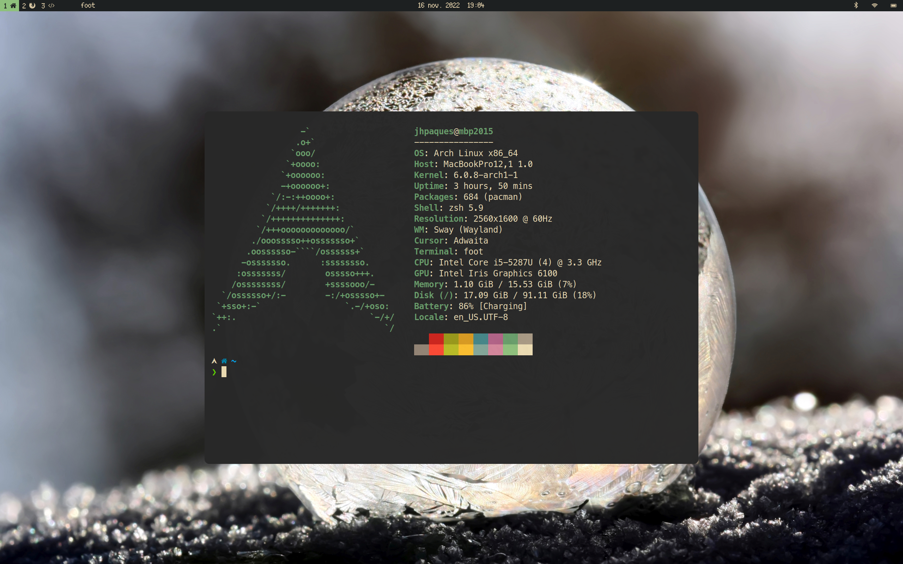
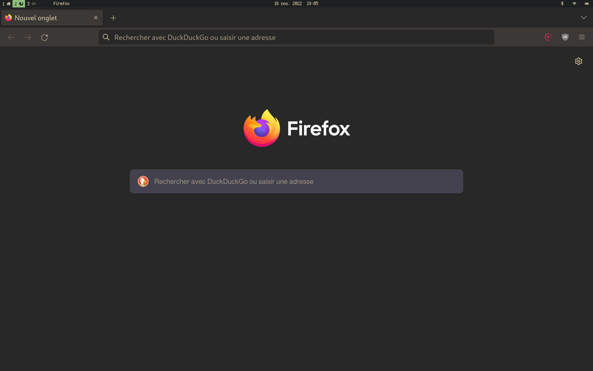
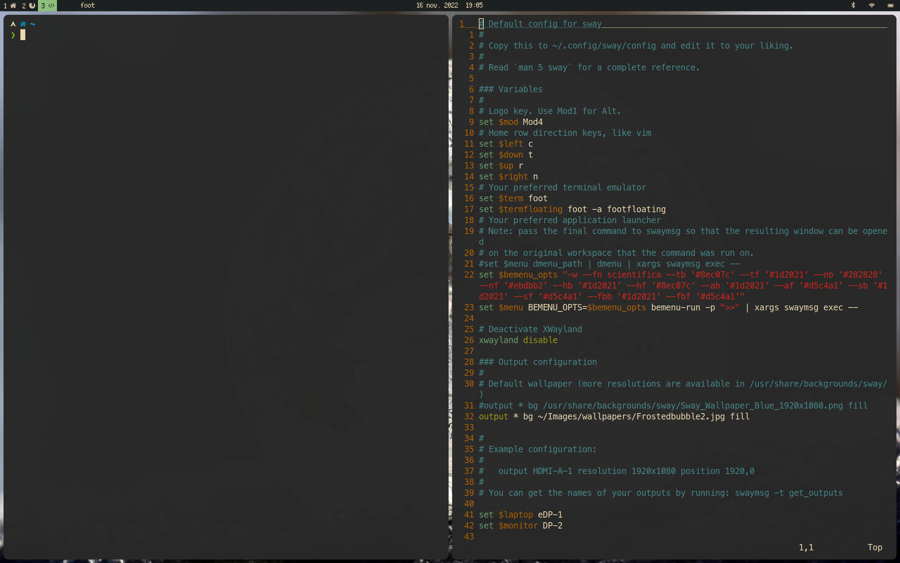

# Dotfiles

- WM: [swayfx](https://github.com/WillPower3309/swayfx)
- Terminal: [foot](https://codeberg.org/dnkl/foot)
- Wallpaper: [Frostedbubble](https://commons.wikimedia.org/wiki/File:Frostedbubble2.jpg)
- Color scheme: Gruvbox light/dark
- Menu bar: [waybar](https://github.com/Alexays/Waybar)
- Active corners: [waycorner](https://github.com/AndreasBackx/waycorner)

## Installation

```bash
git clone https://github.com/jhpaques/dotfiles
cd dotfiles
stow -t ~ <module>
```

## Screenshots





